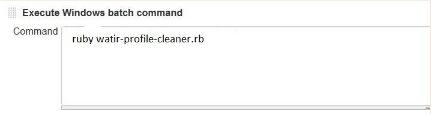

## watir-profile-cleaner
cleans all profiles which created by results of running Test automation executed with watir (An open source Ruby library for automating tests) and clear spaces on machines which was unnecessary captured.
## Problem Statement and why there is need to develop and code utility program with Ruby language:
:cyclone::cyclone::cyclone::cyclone::cyclone::cyclone::cyclone::cyclone::cyclone::cyclone::cyclone::cyclone::cyclone::cyclone::cyclone:

When watir /ruby / selenium test automation runs on machines; each times execution creates watir profiles under temp folder, and as test automation runs multiple times / multiple days run on same machine, it captures all watir profiles under temp folder and slowly start occupying machine’s space where test automation is running i.e. Jenkins, Windows boxes, Virtual machines or where ever scripts are running on continuous basis. This will eventually lower machine’s performance and at some point, kills the machine itself if those watir profiles won’t cleaned up manually on regular intervals. Sometimes it is hard to find problems about this when everything running fine and suddenly machines started to slowing down and having performance issues.

## Now lets start with what is Selenium:
Selenium mainly being used to automate web applications which runs predominantly on web browsers, it can automation mainly any functionalities / tasks which runs on web GUI. Mainly selenium has two parts; 
1. Selenium Web Driver 
2. Selenium IDE 
We will discuss only about Selenium Web Driver which helps to create effective regression / smoke tests based on browsers and can be implemented on different environments / operating systems. As well selenium supports many programming languages bindings, most famous are Java, Ruby, C#, Python. 

## Now lets understand What is watir:
             
watir is Ruby language’s library / gem which is open source and interact with browsers like humans, i.e. filling out text boxes, clicking on links, navigating to pages and verifying different elements on web pages. watir built upon Selenium under the hood. To understand more about watir frameworks and methods review below link.
http://watir.com/

## Here is Resolution to problem

:loudspeaker::loudspeaker::loudspeaker::loudspeaker::loudspeaker::loudspeaker::loudspeaker::loudspeaker::loudspeaker::loudspeaker:

https://github.com/devanshu20/watir-profile-cleaner.git

watir profile cleaner utility keeps machines clean, can be plugged into any web test automation projects using Ruby as programming language. This utility can be run individually or configured on Jenkins jobs to run before test automation kicks off, which will clean machines before start executing test automation.

## Execution Result:

## How to Config to run in your automation suite:

### In your Local (within Ruby / Selenium / Watir Test automation project):

  -	Keep utility anywhere in your project folder structure and run frequently to keep machine cleaned.
  -	Keep above utility code first thing in before hook, so it will run and clean all profiles before starting Test automation fresh.

### On Jenkins(CI Server):

In job's build keep run utility before test automation executes, this will take care of cleaning all watir profiles and keeps all machines cleaned before test automation executes through Jenkins every time.

